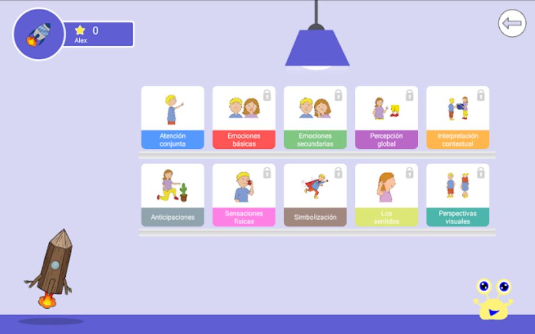
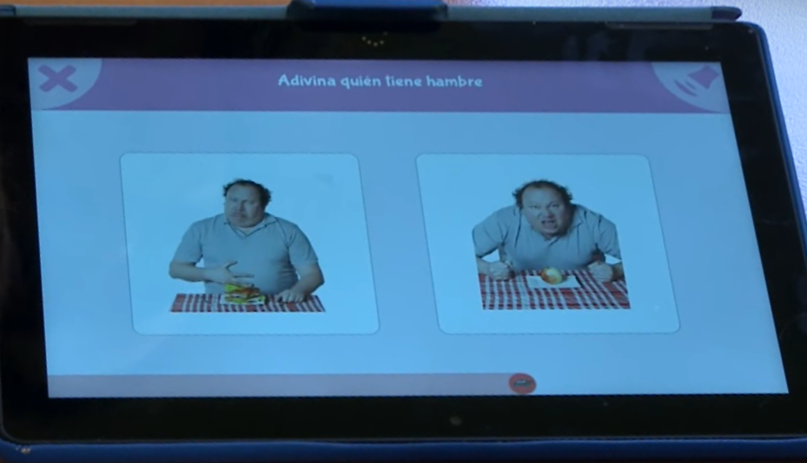
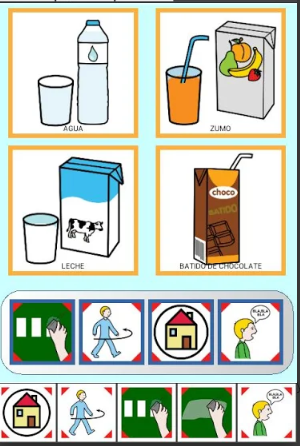
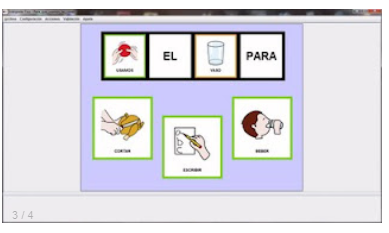
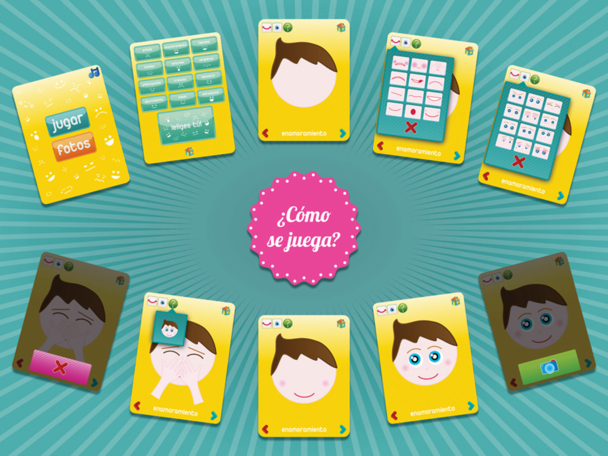
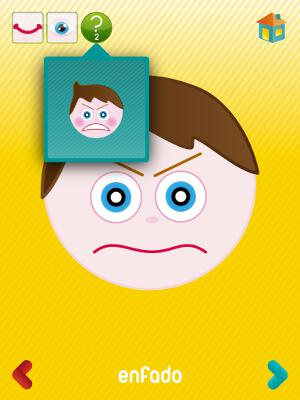

# Learning the context of use

## Problem definition

### Problematic

Low development of social cognition in children with Autism Spectrum Disorder.

### What is Social Cognition?

According to the **American Psychological Association Dictionary of Psychology**, Social Cognition is: cognition in which people perceive, think about, interpret, categorize, and judge their own social behaviors and those of others. The study of social cognition involves aspects of both cognitive psychology and social psychology. Major areas of interest include attribution theory, person perception, social influence, and the cognitive processes involved in moral judgments.

### Consequences

People with a low development of social cognition have difficulty in communication, therefore, it is difficult to interact with others, achieve goals or initiate social relationships, therefore, the child is usually isolated.

### Why do we choose this path?

The initial problematic that we defined was **Language Disorders**, but it is a very broad area, so we decide to find help from profesionals. After an interview with Victor, an occupational therapist, we decide to delimit the problematic to **Language Disorders in Children with Autism Spectrun Disorder (ASD)**, that was because he told us that language disorders are very related with ASD and is are more common in children. Victor help us to better understand the basics of Language Disorders and ASD, but he is not an expert in language therapies, so he give us the number of a language therapist. We already had have two interviews with Ashanty, the language therapist. In the firt one we decide to explore the **Augmentative and Alternative Communication (AAC)**, but she told us that it is a highly explored area in terms of technological tools that help in therapies, so she recommend us to focus on a higher level and less exlored area of language disabilities, Theory of Mind (ToM) and Social Cognition. Also she told us that ASD is the condition in which the impact on social cognition is most seen. Derived from all this, we decided that the final problematic would be: **Low Development of Social Cognition in Children with Autism Spectrum Disorder.**

## Identifying target users

### Research techniques

#### Interview

Get to know the users through the lens of an expert in the field. (Expert opinion). This accelerates and deepens understanding of users. Regarding structure, semi-structured interviews were chosen to provide a balance between quantitative data collection and qualitative discussions. Audio of each interview is recorded when interviewee provides consent and when the context allows it.

#### Observation

In addition to the expert opinion gathered during interviews, observation of the users provides a better understanding of their context of use, challenges and needs. The observation is performed directly when children are in a session of social cognition therapy.

#### Persona

This tool helps focus user gathered information into a concise representation. Personas can be used to prioritize requirements according to user's needs and goals as well as to avoid discussion and implementation of unnecessary features. Additionally, key non-funcional requirements may be present in instances of this tool. Regarding structure, the following characteristics are considered for a persona:

| Characteristic | Description and provided value |
|---|---|
| Photograph | A photograph helps humanize the persona, reminding everyone that we are designing for people who have specific challenges, goals, needs, etc. |
| Name | Similarly to a photograph, a name makes it easier to empathize with the persona. |
| Age | Demographic data that is very likely to shape other characteristics of the persona. |
| Mental disability | Specific diagnosis. This has a broad impact on the persona and can further provide information by focusing literature revision. |
| Family | Family is a key part of a person's social life and it is important to understand family compositions. |
| Needs | What are the current unmet needs of our users. This includes any resource or support currently lacking in the context of use. |
| Goals | We want to understand user's ultimate goals to ensure our product enables them to achieve them in the best way possible. This has an impact on prioritization of functional requirements. |
| Challenges | This encompasses any barrier that is present to the user and indicates what elements we should avoid and, if necessary to include, what elements we should provide special consideration in their design. Key non-functional requirements could be present here. |
| Affinity to technology | This provides an baseline indicator for how likely the product is to be adopted by our target users. |
| Familiar/Anxious about | To increase ease of adoption and satisfaction of use, it is important to understand what the users are comfortable and familiar with. On the other hand, we should strive to avoid including in the design any element which is anxious-provoking. |
| Context of use | How, when and with whom is the product used. |

### Exploratory interviews

The purpose of the exploratory interviews was two-fold: (1) gather initial and general information about children with ASD in Mérida, Yucatán and (2) explore any problems they have related with language.

The first approach we had in the field was through a semi-structured interview with Víctor Prudencio, an occupational therapist who has ample experience working with children diagnosed with Autistic Spectrum Disorder (ASD). Here we understood that language, focus and socializing are common challenges for children with ASD. These findings aligned with our reading of Diagnostic and Statistical Manual of Mental Disorders, DSM-5.

To further understand children with ASD and their challenges associated with language, we conducted an semi-structured interview with Ashanty Pérez, a language therapist who has 20 years of experience working with children with ASD and specializes on developing theory of mind with patients over 3 years old. She also works with low and high-technology Augmentative and Alternative Communication (AAC) devices, and informed us that children have much higher adoption of high-technology mediums (i.e. mobile apps). We also learned that language development is key to children's wellbeing, as it allows  him or her to effectively communicate desires and needs. AAC devices are widely used for this purpose, and they don't only improve life-quality of these children, but also of their relatives.

A next-step challenge, related with language, for children who have become comfortable with expressing basic needs and desires through AAC tools, is developing social cognition: understanding social situations, which includes comprehending other people's feelings, thoughts, beliefs and how they differ from the own.

## Market analysis

### AutisMIND

AutisMIND is an app to stimulate the development of Mind Theory and social thinking in children with Autism Spectrum Disorders.

AutisMIND contains 10 different themes related to aspects of the Theory of Mind, with 6 levels of increasing difficulty and more than 1,000 recreational and interactive exercises.

In this application, the themes chosen focus on precursor skills to social thinking, such as joint attention or the ability to symbolize, without these it is very difficult to develop the Theory of Mind, which allows the child to infer mental states in the other and adjust their own behavior to adapt to a given situation.

#### Topics addressed:

* Joint attention
* Secondary emotions
* Interpretation of
* emotions by context
* Physical sensations
* Organs of the senses
* Basic emotions
* Global perception
* Anticipation of actions
* Symbolization
* Visual perspectives

#### AutisMIND screenshots

    

    

[More about autisMIND](https://autismind.com/)

### TICO Project

TICO Project  (Tableros Interactivos de COmunicación) is a computer application to generate and use communication boards interactively.
The program consists of two independent and differentiated but complementary applications: Editor and Interpreter.

With the editor's application you can create communication boards with contain visual, auditory or environment control elements.

With the interpreter's application, the boards previously created with the editor's application can be visualized to develop communicative limitations and to help specialists in their therapies.

#### TICO Project screenshots

    

    

[More about project TICO](http://www.arasaac.org/software.php)

### ¿Qué tal estás? App

¿Qué tal estás? App is an application created to work and develop the identification and expression of children's emotions.

The app is available in 6 languages and consists of a very simple drawing environment with 12 emotions (happiness, enthusiasm, crush, surprise, well-being, boredom, shyness, shame, fear, worry, sadness and anger), the child will have to compose with drawings that represent the eyes and mouth. The child has a small help that he can use up to 3 times and once the emotion is resolved he will be photographed himself imitating it.

In addition, the game allows us to use it backwards, guess the emotion according to the picture we take.

The application is created for children between 3 and 6 years and also designed for people with Autism Spectrum Disorder (ASD) who will find it very useful both therapeutic and school or family level empathizing with the people around them.

#### ¿Qué tal estás? App screenshots

    

    

[More about ¿Qué tal estás? App](https://aulautista.wixsite.com/teapps/qu-tal-ests)

## Metrics

### Individual contribution and project progress

The project is divided in deliveries defined by the teacher. Every delivery has activities and every activity has the following attributes:

* **Complexity:** Measured by Complexity Points (CP). The scale is based on Fibonacci series (3, 5, 8 & 13). The number of CP for every activity is assigned based on a consensus with the team.
* **Delivery Percentage of Completion:** It is the percentage assigned to the activity, which refers to the progress made in the whole delivery. Is defined by a hundred divided between the total number of activities in a delivery by the CP of the activity.
* **Criteria:** Define the process that will be followed in order to successfully do the activity. The criteria will help us to define the number of CPs that we are going to asign to each activity and how many points each member can earn.
* **Number of points asigned to each member:**  The number of points assigned to each member is defined by the whole team and is based primarily on the criteria of the activity.

After define every of this attributes for all the activities from each delivery, is time to measure.

The **individual contribution** is calculated for each delivery. The calculation is done by dividing one hundred by the total CP number of the delivery. The result is multiplied by the total number of CPs of each team member. The result is expressed in a percentage.

The sum of the individual contribution percentage of each team member in a delivery, is the current **progress of that delivery.**

Here is the link to the [Google Sheets Document](https://docs.google.com/spreadsheets/d/1PG3QAMMSaIHhpFBE-icTz4Kvc2XZR41v1gc5CbGukCs/edit?usp=sharing) with the metric application.
