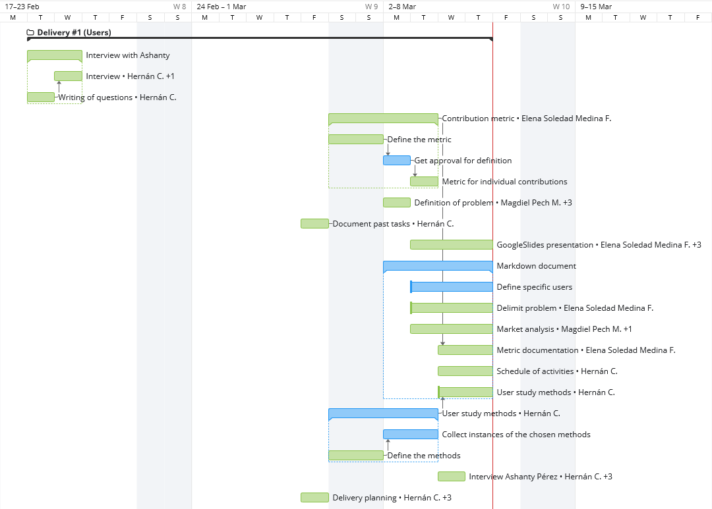
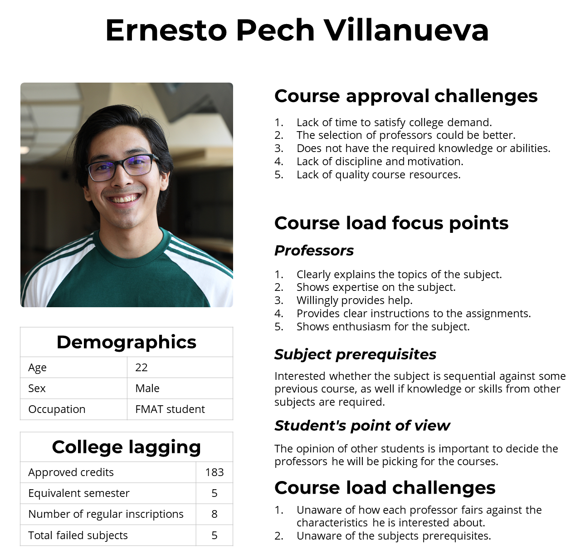

# First delivery

## Table of contents

<!-- TOC -->

- [Table of contents](#table-of-contents)
- [Definition and justification of the problem](#definition-and-justification-of-the-problem)
- [Research planning](#research-planning)
- [Learning about our users](#learning-about-our-users)
  - [Research techniques](#research-techniques)
    - [Interview](#interview)
    - [Survey](#survey)
    - [Persona](#persona)
      - [Attributes](#attributes)
  - [Analysis of survey results](#analysis-of-survey-results)
- [Market analysis](#market-analysis)
- [Metrics](#metrics)
  - [Individual contribution and project progress](#individual-contribution-and-project-progress)

<!-- /TOC -->

## Definition and justification of the problem

The problem that will be the focus of our project can be concisely summarized in the following sentence:

    <b>The College Lagging and Dropout in Faculty of Mathematics of UADY.</b>

The college lagging is very common among the students of the different degrees offered in the state of Yucatan. The Autonomous University of Yucatan (UADY) represents approximately 22% of the total enrollment of the entire state.

According to a study carried out by the same institution in the 2013-2014 school period, a third of the students presented a history marked by: failed subjects, low grades and low percentage of accreditation in the courses taken. In this matter, the “Campus of Exact Sciences and Engineering” stands out particularly, due to a percentage of students with at least one failed subject, which represents a little more than the average.

This means that only a third of the student population in this campus managed to accredit good grade in every subject. In the Faculty of Mathematics, approximately half of the students have some of the following problems: failed or recoursed subject, or low percentage of accreditation in the courses taken.

In summary, the college lagging in the Faculty of Mathematics of UADY is widely common mainly due to the factors exposed above, causing a delay in the estimated year of graduation of the students and in the worst cases, dropout.

## Research planning

Tasks are planned using a Gantt chart generated in [Wrike](https://www.wrike.com/), a work planning application. Since it is not possible to produce a view-only url to the chart, an image of the past activities is provided below.

    

Tasks in blue are not completed, whilst tasks in green are done. For this delivery our debt comprises the definition of target users. Although we have defined the user [research techniques](#research-techniques), observations are yet to be made and more data needs to be collected to build correct and useful personas.

## Learning about our users

### Research techniques

Due to time constraints, light research techniques are chosen over logistically complex techniques, such as focus groups. However, it is still relevant to account for techniques which can provide both demographic and behavioral data. According to our constraints and needs, surveys and interviews are the best choice to collect data, while personas provide a useful synthesis of the findings. Although an interview is not logistically trivial, we deem it can provide very useful information which might not be collected through a survey.

#### Interview

Most of the user research data is collected through surveys because of time limitations. However, in addition to the personal stance of each student regarding their academic lagging and course load focus points, we decided that getting to know the [perspective of M.O.C.E. Sharon Escobar](https://docs.google.com/document/d/1JYiS7qN4cI6aELYs5BIGxbX5_8oJCv24ssoIQLMZnR8/edit?usp=sharing), who is jointly in charge of Departamento de Orientación y Consejo Educativo (DOCE) along with Laura Sánchez, about the topics can be of great value, specially for building a high level appreciation of the problem. The interview is realized through Google Hangouts, is semi-structured and aims to collect qualitative over quantitative data.

#### Survey

This is the primary technique to collect user data. Direct user data is collected through interviews, asking for both demographic, academic lagging situation and behavioral aspects better explained in the [persona attributes section](#attributes). All survey questions are closed, thus easing the analysis process. For the development of the instrument, [planning](https://docs.google.com/document/d/1-E-l1MsTpaTzvSSsh_zbFpiRI7vKQ1D3-QuvS3-VavA/edit?usp=sharing) between Elena and Hernán was done to determine the target audience, objectives and broad sections of the survey. The implementation of the instrument exists as a [Google Forms survey](https://forms.gle/RMYWEKWCQqM96fQW9).

#### Persona

> "Personas are basically digestion of formative work."
>
> — Predrag Klasnja on [UX Design: From Concept to Prototype](https://www.coursera.org/lecture/ux-design-concept-wireframe/lesson-1-personas-JgbbA)

Persona is a widespread UX tool which provides a synthesis of user research that is relevant to designers, marketing teams and business stakeholders. In the scope of this HCI college project, all the benefits we can obtain from personas are limited to those that a design team would expect, since we are not doing marketing work let alone have business stakeholders involved. As a team who will do design work in the next phase, we expect a properly built persona to provide us with the following:

- Summarize user research data and information into a tool that provides a mental shortcut for design considerations, i. e. “[personas] must be able to answer all the questions I will have when I am redesigning an experience”, as Katrina Benco mentions in a [TandemSeven article](https://www.tandemseven.com/experience-design/5-signs-youre-creating-personas-that-wont-be-effective/).
- Remind ourselves that we might be designing for people who are very different from us.
- Allow a discussion among ourselves about who the intended users are.

In the context of college lagging in FMAT, personas can be a place for concentrating course load selection challenges and any other academic circumstance linked to our problem definition. Due to time constraints, only focal personas are considered.

##### Attributes

According to the [Olsen Persona Toolkit](http://www.interactionbydesign.com/presentations/olsen_persona_toolkit.pdf), psychographics and demographics in personas are most useful from a marketing standpoint; an approach out of scope for this project. Consequently, demographics are kept light and serve the purpose of making the personas feel more like a real person. The discrete data covered by the personas spans the following points:

- General
  - Photo
  - Name
- Demographics
  - Age
  - Sex
  - Occupation
- College lagging
  - Approved academic credits
  - Equivalent semester
  - Number of regular inscriptions
  - Total failed subjects

Although discrete data provide certain context, attributes which answer design questions during the prototyping phase are most relevant and will be emphasized in our personas. These attributes provide insight into user behavior about if and how our product will be used.

| Behavioral attributes      | Provided value                                                                                                                                                                                                                                                                                                                                                                                                                                               |
| -------------------------- | ------------------------------------------------------------------------------------------------------------------------------------------------------------------------------------------------------------------------------------------------------------------------------------------------------------------------------------------------------------------------------------------------------------------------------------------------------------ |
| Course load focus points   | Understanding what students are looking forward to in their next semester courses is important to emphasize what type of data is relevant to handle and how to make it visible. Current lagging students might be looking for a mix between easy and challenging courses, or perhaps professors who are the most willing to lend a helping hand during the course. Identifying what parameters they care about is key to understanding what we should track. |
| Course load challenges     | Challenges hint pain-points in the current process for deciding course load. By identifying these we encounter opportunity areas to improve the current experience by providing services which mitigate the challenges or design around them.                                                                                                                                                                                                                |
| Course approval challenges | Acknowledging the challenges students face against approving a college course can hint the need for a particular feature, for instance, academic resources shared by other students.                                                                                                                                                                                                                                                                         |

### Analysis of survey results

    

We began direct user research through a [Google Forms survey](https://docs.google.com/forms/d/e/1FAIpQLSdWSt5c_7W73E6VW2SlbORud-nXuXmAbdKkK6zY1T-b_FMH2w/viewform) that was opened on April 18th. We obtained 39 responses, of which 67% are men and 33%, women, between 20 and 27 years old. The surveyed covered students from all majors offered by Facultad de Matemáticas (FMAT):

- 15 students from _Licenciatura en Actuaría (LA)._
- 4 students from _Licenciatura en Ciencias de la Computación (LCC)._
- 2 students from _Licenciatura en Enseñanza de las Matemáticas (LEM)._
- 1 student from _Licenciatura en Ingeniería en Computación (LIC)._
- 10 students from _Licenciatura en Ingeniería de Software (LIS)._
- 6 students from _Licenciatura en Matemáticas (LM)._

The median of the equivalent semester to which the surveyed students belong is 5 (fifth semester). This value corresponds to the information that professor Sharon Escobar had shared with us in an interview prior to the application of the survey. In her experience, during the first two semesters of bachelor’s degree, the most common cause of college dropout at FMAT is vocational. From around the third semester and henceforth, the main causes are lack of time, knowledge or abilities to satisfy college demand. She also mentioned that college dropout is a consequence of college lagging. Lack of time, knowledge or abilities are among the three main causes of college lagging reported by the students surveyed, data which aligns with the information provided by professor Sharon.

College lagging is a consequence of failing one or more subjects, thus we are interested in knowing why FMAT students fail. According to survey results, the main reasons are:

1. Lack of time to satisfy college demand (61.5%).
2. The selection of professors could be better (59%).
3. Does not have the required knowledge or abilities (53.8%).
4. Lack of discipline and motivation (48.7%).
5. Lack of quality course resources (28.2%).

Likewise, we want to know what students consider to do their academic load and what difficulties they face in the process. We notice that 79.5% of students take into account other students’ opinions to decide the professor they will be picking for the courses. The main professor’s characteristics that students consider are:

1. Clearly explains the topics of the subject (84.6%).
2. Shows expertise on the subject (82.1%).
3. Willingly provides help (64.1%).
4. Provides clear instructions to the assignments (64.1%).
5. Shows enthusiasm for the subject (64.1%).

In addition, 64.1% of students prefer a balance between professors with low and high levels of demand, 30.8% choose just the most demanding professors and only 5.1% prefer the less demanding professors.

Regarding subject prerequisite, students consider:

1. If a subject is sequential against another in the curriculum mesh (56.4%).
2. If a subject requires knowledge of another subject, but it is not explicitly serialized (53.8%).
3. Minimum required knowledge of prerequisite subjects (53.8%).

Finally, the main difficulty students face to do their academic load is that they don’t know the characteristics that interest them about the professors.

Initially, we intended to define two different personas, so we divided survey results in two groups. First group corresponds to majors related to computer science (LIS, LCC, LIC) and the second group corresponds to majors related to mathematics (LA, LEM, LM). An [informal comparison](https://docs.google.com/spreadsheets/d/1-gzGV5pp8Rn_IsT4TfXfWIbQBrE536f3DgQXlQ6IXjk/edit#gid=1722935349) was made between the results of both groups and we didn’t find a significant difference between them. Regarding demographic data and students' college lagging situations, the measures of central tendency were very similar in both groups. The data about the characteristics that students consider to do their academic load and the difficulties they face in the process are similar in both groups. For each question, main answers remain, but in some cases their positions change.
Let's take the following question as an example: What points have contributed to failing a subject?
The most chosen responses by the first group are:

1. Lack of discipline and motivation, the selection of professors could be better, lack of time to satisfy college demand.
2. Does not have the required knowledge or abilities.

and by the second group are:

1. Lack of time to satisfy college demand.
2. Lack of discipline and motivation, the selection of professors could be better.
3. Does not have the required knowledge or abilities.

As you can see, the same responses are in both groups. Only its position varies, "Lack of discipline and motivation" is in first spot for group 1 and in second spot, for group 2.

## Market analysis

The preliminary market analysis done for this delivery can be found in a [separate document](documents/MarketAnalysis.md). The purpose of this research and analysis is to understand what has been developed and what features or areas are still unexplored by the market.

## Functional requirements

1. The user will have to log-in to the system before writing a review.
2. The user can filter through a search bar the name of the teacher they need.
3. The user will be able to add a new teacher to the system.
4. The user will be able to make a review of an existing teacher.
5. The user will specify what subject he studied with the teacher.
6. The user will answer a questions rating the teacher's performance in the subject taught.
7. The user will be able to add a comment about the teacher.
8. The user will be able to view the teacher's profile with their reviews.
9. The user will be able to validate the skills of the teacher's profile related to the subject.
10. The user may indicate that they agree with another review.
11. The user will be able to report an existing review.

## Metrics

### Individual contribution and project progress

> This metric has been applied to the first delivery of the project. The detailed application can be found in a [Google Sheets document](https://docs.google.com/spreadsheets/d/1LhBCNRYAx3nGcG9hvMuaJZ4Yp-vwHcNEHb5YikoQmlE/edit?usp=sharing).

The project is divided in deliveries defined by the professor of the course, Edgar Cambranes. Each delivery has activities and each activity has the following attributes:

- **Complexity Points (CP):** The scale is based on Fibonacci sequence (3, 5, 8 and 13). Instead of using consecutive integers, the Fibonacci sequence was preferred because points scale better, highlighting those who contribute the most. The CP for each activity is assigned in a team meeting, guaranteeing consensus.
- **Delivery Percentage of Completion:** Percentage assigned to each activity based on the total percentage delivery activities. It is defined as the product of the activity CP by the ratio of one hundred among the total number of delivery activities. `(100 / total number of activities) * Activity CP`.
- **Criteria:** Define the sub-activities done in each activity and depending on those sub-activities, the team can have a better idea of ​​how many CP each member deserves.
- **Number of points assigned to each member:** Every activity has a specific CP that is divided among team members that worked on the activity. The whole team decides how many CP of the activity will be assigned to each member (distribution doesn't have to be equal). CP sum of all members who worked on the activity has to be the same as the total CP of the activity.

The individual contribution is calculated for each delivery. The calculation is done by dividing one hundred by the total CP of the delivery. The result is multiplied by the total CPs of each team member and the result is expressed in a percentage. The sum of the individual contribution percentage of each team member in a delivery is the current delivery progress.
