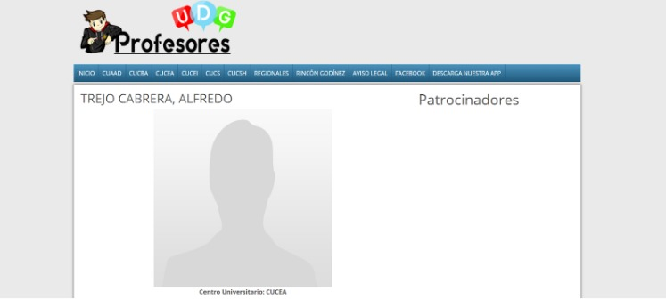
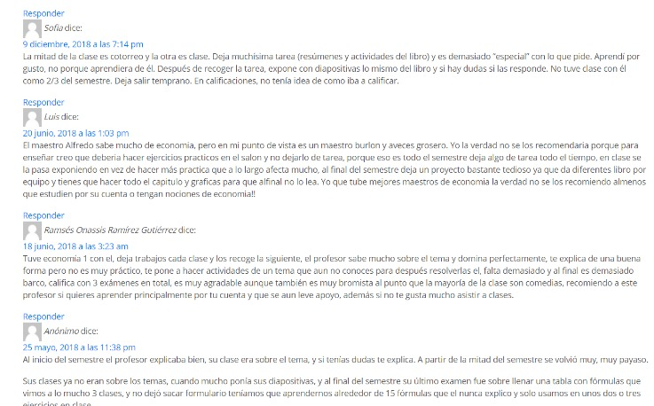
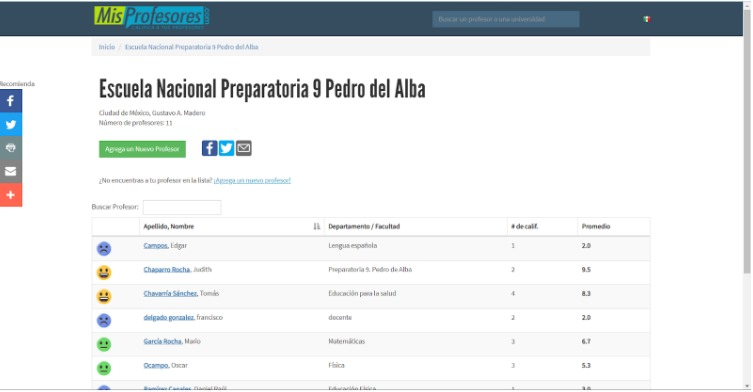

# Market analysis

## Rate My Professors

Rate My Professors is a website that allows you to leave a score on a professor at your university.

To use the application you have three alternatives:

1. Search for a professor, it will ask for the institution's name and the professor's name, then you will be able to see the professor's profile, with an average rating of 0 to 5, also the comments that different students have left about him, in those comments you will see the level of difficulty of their subject, the quality of teaching, if he ask for a book, if attendance is relevant and a short review for the teacher.

2. Search for a university and see the reviews that students leave about it, from comments to find out if the internet is good, if the school cafeteria provides good service, if the library is good, managing a rating from 0 to 5.

3. To qualify a teacher, first you will have to add the teacher's name and it will show you the match that it makes with the teachers and the universities where he teaches their subject. Then the system gives you some tips on how you should evaluate a teacher, check the grammar of your comment and correctly specify your course, talk about the teacher's skills, how he teaches the subject and how clear he is when speaking, his class dynamics, the system also advises you that you should not make offensive comments towards the teacher, or denigrate his profession, nor should you say if he has favorites or something like that, irrelevant topics. After reading the tips, you start by adding the subject taught by the teacher, asking for a grade from 0 to 5 towards the teacher, also the level of difficulty of the course, later asking if you would take a course with the professor again, if he asks you for a book, if the assists are relevant, your grade obtained in the course and finally, a review of the teacher.

This website allows you to create an account to display your comment generated to the teacher, however, it also allows you to leave the comment anonymously.

    

[More about Rate My Professors](https://www.ratemyprofessors.com/)

## Profesores UdG

Profesores UdG is a web page that allows you to rate the professors of different departments of the University of Guadalajara. On the main page you can search the name of the teacher you need, also you can search by department and see the latest added comments for each teacher.

In this system there is no rating for each teacher, however, you can view the comments that different classmates have left about him. Also, you can leave a review of the teacher and answer some basic questions about the teacher and his teaching methods.

    

    

[More about Profesores UdG](https://www.profesores-udg.com.mx/)

##Mis Profesores:

Mis Profesores is a web page that allows you to rate teachers from different institutions, where you can filter by teacher or by university.

By teacher: When you filter by teacher you will be able to view the teacher's profile, a rating from 1 to 10, if it is recommended to take classes with him and the level of difficulty of passing a subject with him, also you will be able to see a tags that students add to their profile, such as: "be prepared to read", "very demanding", "respect the students", etc. You will also be able to see the comments of different students as well as their obtained grade and the review they leave for the teacher.

By universities: only shows you the universities and the professor's name, then the profile of the professor you want to see.

    

[More about Mis Profesores](https://www.misprofesores.com/)
