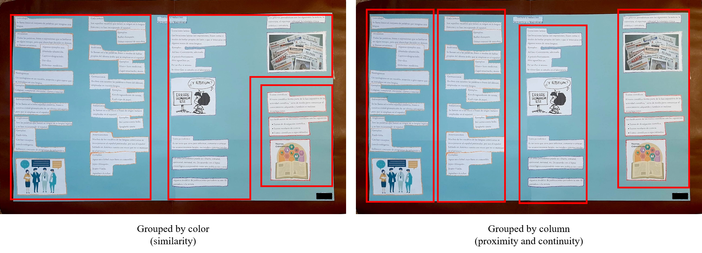

## 27.02.20 My understanding of Gestalt theory

The core idea behind Gestalt theory is that human perception is holistic, as opposed to reductionist. This view can be summed up in the phrase "the whole is not equal to the sum of its parts". More simply put, humans have a natural tendency to organize, group and and make a coherent *whole* from a given set of objects that might or might not be organized.

This process of organization is said to be *naturally* occurring since the cues which promote it are never learned by study by each person, but rather they happen to evoque a reaction on people, even when they are unaware of the actual principles.

So what are these *natural* cues or principles? Gestalt theory proposes seven principles: (1) closure, (2) common fate, (3) continuity, (4) figure ground, (5) proximity, (6) symmetry and (7) similarity. Subconsciously guided by these principles we organize what we see into groups, categories, flows or hierarchies.

### Gestalt in action

In the below image we can see a poster that my sister did for her high school subject "Lectura y Redacción". Each topic she wrote about is split into various printed pieces of paper; effectively, one topic is covered over various bits of paper.

How can the viewer distinguish which pieces of paper conform to a particular topic? That is, how does a viewer go about logically grouping the pieces of paper?

When I first saw the poster it seemed confusing to me, since I distinguished two mutually exclusive organizations:

* On the left of the bottom image we see a photograph of the poster and three red regions grouping the pieces of paper by the color their borders are marked: orange, purple and red (from left to right).
* On the right of the same image we see the same poster, but now divided into columns indicated by the red boxes. This might be a more sensible organization if colors are not initially evident.

    

