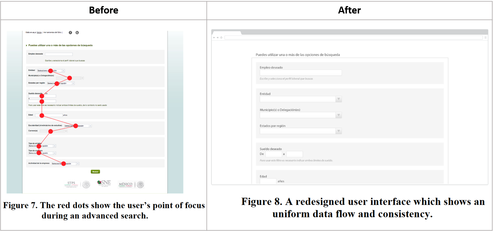

## 25.04.20 Usability testing for the redesign of _Portal del Empleo_

> Paper referenced: Mario A. Moreno Rocha, Carlos A. Martínez Sandoval, J. Salvador Aguilar Bautista, and Heriberto López Ramírez. 2014. Developing a Usability Study for Mexican Government Sites: the Case Study of the Portal del Empleo. In Proceedings of the 5th Mexican Conference on Human-Computer Interaction (MexIHC ’14). Association for Computing Machinery, New York, NY, USA, 1–6. DOI: <https://doi.org/10.1145/2676690.2676692>

[_Portal del Empleo_](https://www.empleo.gob.mx/loginGOB) is a website created as part of an effort by _Secretaría de Trabajo y Previsión Social_ (STPS) to provide easy and widespread search of job vacancies in Mexico.

Throughout 6 months spanning 2013 and 2014, _UsaLab Laboratorio de Usabilidad_, at _Universidad Tecnológica de la Mixteca_, performed a usability study with the main objective of proposing recommendations on the design and usability of the site. Three broad approaches were used in the usability research: expert analysis, contextual study and usability testing; I am going to focus in the latter.

### Usability testing

The usability testing was performed over three tasks: login, registration and job search. However, the specific subtasks for each main task are not mentioned. The users were selected from 6 states of the country.

The most interesting part about the usability testing is the objectives and aspects taken into account, because these constitute a metric for _UsaLab_ about how usable _Portal del Empleo_ is; moreover, it guides what should be improved and what is not required to modify.

The tests consider three objectives:

1. **Effectiveness:** Defined as whether or not a user is able to successfully perform a task. Even if the task is performed with difficulty, it is considered successful. No time limit is provided in the paper for this objective.
2. **Efficiency**:  The speed at which a task is able to be performed is considered a relevant measure to usability. However, no expected time is provided, only a record of the min, max and average times of the actual tests.
3. **User satisfaction**: Understood as the general preference of the user for the elements of the system. I was expecting an ordinal scale for the report of the findings, but instead the paper provides a word cloud regarding the responses of user satisfaction questions. I think this is interesting, though perhaps a numeric or textual measurement from a scale could also have been useful.

During the evaluations, special attention was put into identifying the following:

1. "Value of information presented to the user." This consideration was useful to pin point design elements which were distracting or not providing value to perform a task. It was also used to better judge the size of focal points in each view of the site. For example, the size of the login box was increased in the home page.
2. "To  detect  information  and  elements  needed  by  the  user  to perform specific tasks."
3. "Identify    strengths,    weaknesses and errors’ location, hierarchy graphic  design,  labelling,  etc. on the  elements arranged on the page." The advanced search view showed a location problem, making navigation complicated by not providing a smooth path to move among the form fields.

    

