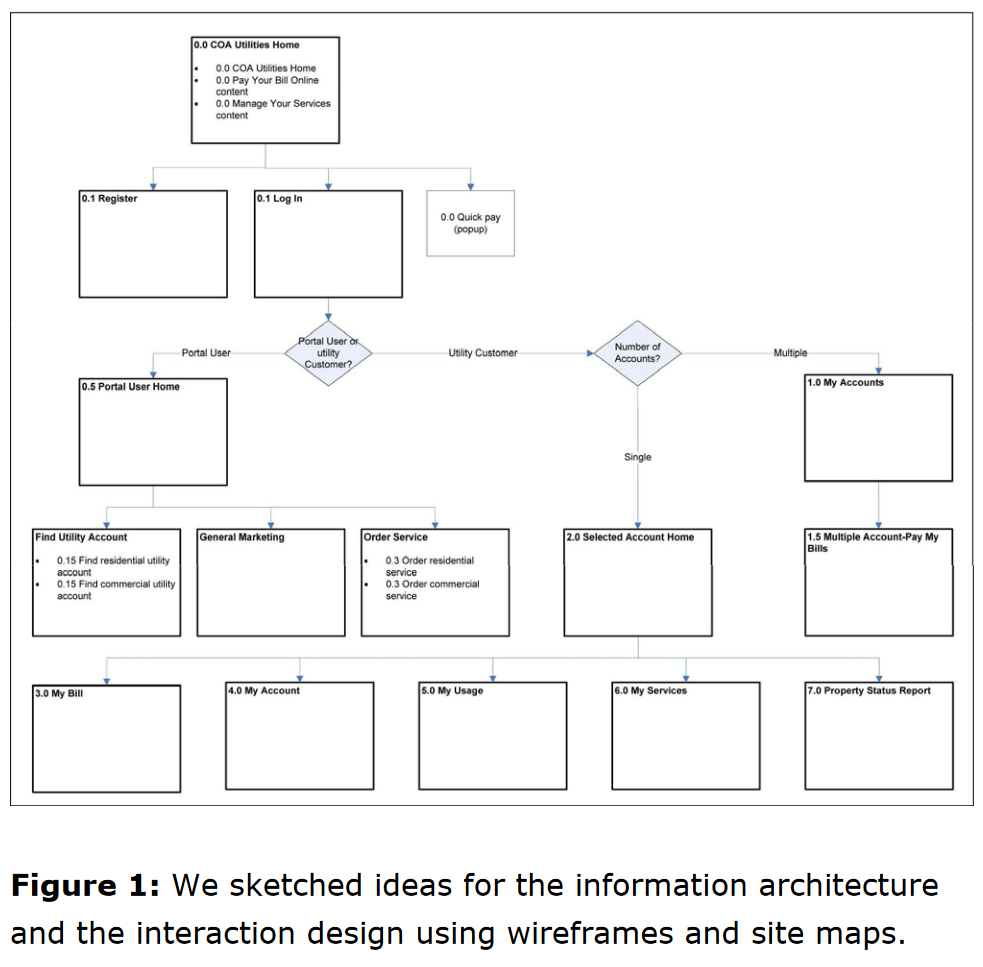

## 06.05.20 Information architecture (IA)

> Summary of [Information Architecture. Basics for Designers](https://uxplanet.org/information-architecture-basics-for-designers-b5d43df62e20).

According to The Information Architecture Institute (IAI), "information architecture is the practice of deciding how to arrange the parts of something to be understandable".

IA is not about specific content, but about the content structure insofar organization and layout in a user interface. IA prioritizes user satisfaction, aiming to achieve the most understandable navigation in a software system.

Design relates to IA in the sense that it fills the skeleton formed by the IA of a system. By itself, IA can't produce satisfying and understandable user interfaces, but it does set a high level plan for how data will be accessed throughout the UI.

In _Information Architecture for the World Wide Web_, book by Lou Rosenfeld and Peter Morville, the four main components of IA are described:

- Organization. How information is structured in its presentation.
- Labeling system. Identification of a larger set of data through simple icons or short text.
- Navigation system. Mechanisms which allow the user to move through the system's data.
- Search system. Filtering and searching mechanisms offered by the system.

### Example IA diagram

> Andy Switzky. 2012. Incorporating UCD into the software development lifecycle: a case study. In CHI ’12 Extended Abstracts on Human Factors in Computing Systems (CHI EA ’12). Association for Computing Machinery, New York, NY, USA, 469–484. DOI:<https://doi.org/10.1145/2212776.2212823>

In _Incorporating UCD into the software development lifecycle: a case study_, the following information architecture diagram is shown as a preparative step before building the wireframe prototypes for the UI.

    

