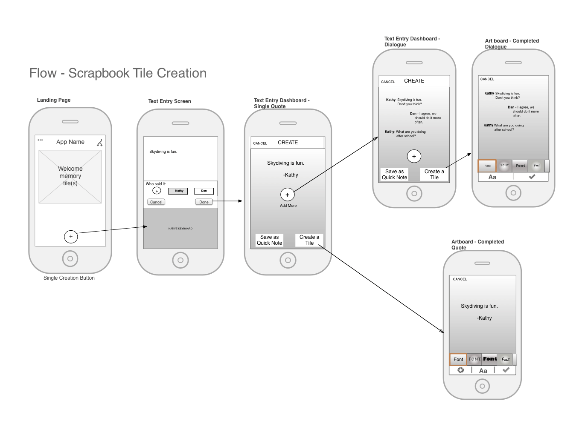

## 09.05.20 Wireflows

> Summary of [Wireflows: A UX Deliverable for Workflows and Apps](https://www.nngroup.com/articles/wireflows/) (2016), by Page Laubheimer.

The article proposes that the design of applications driven by dynamic content are difficult to comprehensively portray through wireframes and flowcharts, thus another type of diagramming tools is required.

Why are wireframes not enough? Wireframes are great for showing the general layout of content in a screen, but don't provide much insight into how interaction with such content and elements can happen. In other words, wireframes are more adequate at showing a **static** view of the user interface.

On the other hand, flowcharts omit contextual data and elements that users might see at each screen and find critical to perform their intended task. However, flowcharts do a better job than wireframes to show the navigation and **interactions** between screens and components.

Both wireframes and flowcharts have their selling point and they are not going away anytime soon, but the problem is that they are separate views of the same system and thus suffer from a kind of partial blindness. The author or the article proposes merging both diagramming tools into a single one which he calls _Wireflows_.

    
     <i>Example wireflow taken from the article.</i>
      

A wireflow shows the relevant interactive UI elements and indicates where they can take you. Sometimes this destination is the same screen, only with different content, addressing in this way the problem of modelling applications heavily reliant on dynamic content. An important note is that a wireflow could be thought of as a graphic use case in terms of wireframes. This is the case because wireflows can be used to show the interactions necessary to complete a task, rather than all interactions available.
