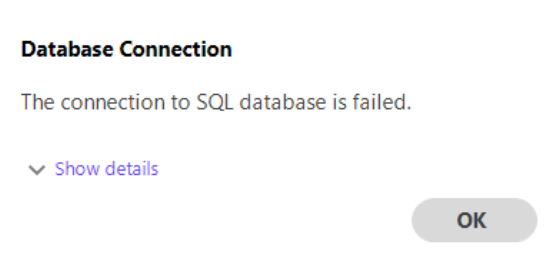
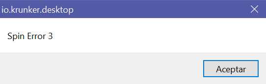
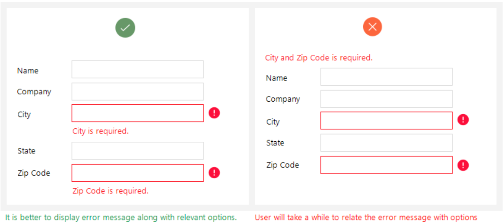

## 13.05.20 Design considerations for error messages

> Summary from [Designing the Not-So-Happy Path](https://medium.com/salesforce-ux/designing-the-not-so-happy-path-fde484759a54#.9jopwl5b3) and [How to write good error messages](https://uxplanet.org/how-to-write-good-error-messages-858e4551cd4).

According to the topic of the previous entry, designers shouldn't expect their users to stay on the happy path for achieving a given task. Instead, embracing the inevitability of users straying away is a good opportunity to think about designing outside the happy path, which primarily involves user error handling. This entry is dedicated to mentioning some design considerations for error messages.

### 1. Short, unambiguous and helpful

Error messages should be short and to the point. In my opinion, they should not span more than two sentences, if there is additional information relevant to the user, putting it in a collapsible details section is a good idea.

    
     <i>Example from <a href="https://uxplanet.org/how-to-write-good-error-messages-858e4551cd4">How to write good error messages</a></i>
      

Being short doesn't mean compromising clarity. An error message should avoid wording which doesn't help the user identifying what he or she did wrong and thus, what can he or she try to fix it.

    
     <i>Example of poor error message from <a href="https://krunker.io/">Krunker.io</a></i>
      

Ambiguity and helpfulness are tied together. Ambiguos error messages don't help the user solving the error, and unhelpful error messages are often ambiguous, whether because the use technical terms or lack information.

### 2. Enhance meaning with placement

The meaning of an error message does not only come from its words, but also from where it located on the screen relative to the other components. On the image below, the error messages on the left are immediately more understandable than those on the right (thanks solely to the placement).

    
     <i>Example from <a href="https://uxplanet.org/how-to-write-good-error-messages-858e4551cd4">How to write good error messages</a></i>
      

The idea shown previously focuses on adding meaning to error messages in terms of **scope**. An error message which is next to a component helps communicate that the scope of the error is limited to that text field. This scope suggestion can also be utilized for wider components, such as conveying a general system error as shown in the images below.

    
     <i>Example from <a href="https://medium.com/salesforce-ux/designing-the-not-so-happy-path-fde484759a54#.9jopwl5b3">Designing the Not-So-Happy Path</a></i>
      

Linked to this presentation which conveys scope, is the implicit idea that error messages mustn't be consisten, i.e. presentation can and should vary to add appropriate meaning (a toaster is not always the best option, neither is a red border with text beneath).

### 3. Avoid negativity

User errors are obviously caused by users, but wording it directly like so can come across as offensive or, on the less severe case, unpleasant. Take the 404 HTTP status code. A short and meaningful error message can be "You are looking for a web page that does not exist", but instead GitHub avoids the blame of the word "you" and eases the error page with a fun animated image.

    
     <i>Example from <a href="https://github.com/folder/file">GitHub</a></i>
      

