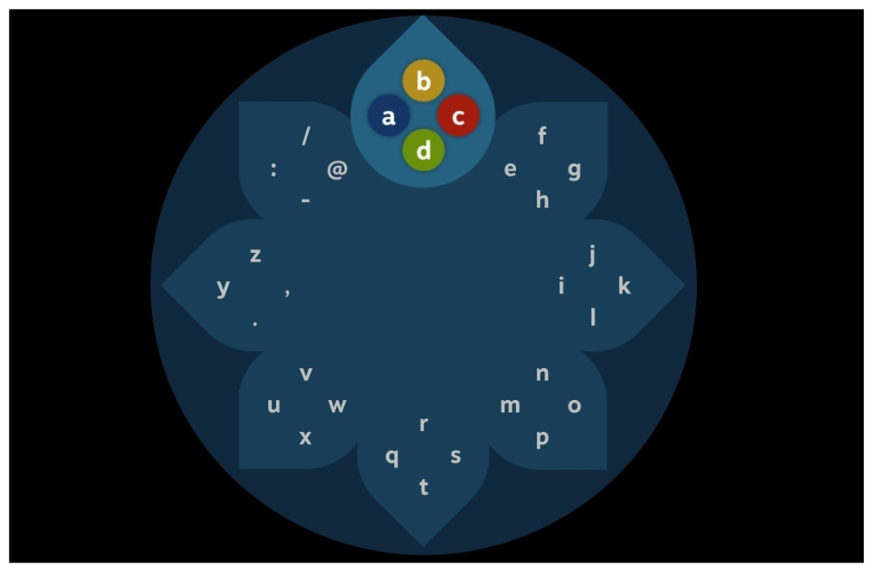
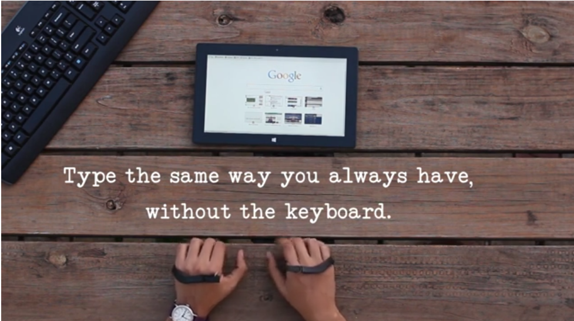
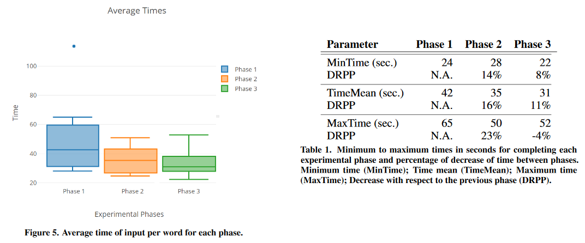
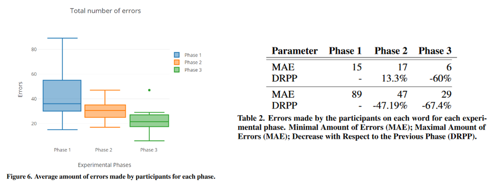

## 15.05.20 Steam's Daisy Wheel for VR text input

> Bruno Barboza Orozco, Aaron Rocha Rocha, and Ana Segundo Sevilla. 2018. Implementation and evaluation of the Daisy Wheel for text entry on touch-free interfaces. In Proceedings of the 7th Mexican Conference on Human-Computer Interaction (MexIHC ’18). Association for Computing Machinery, New York, NY, USA, Article 2, 1–7. DOI: <https://doi.org/10.1145/3293578.3293582>

Unlike other technology devices, the fundamental interaction with keyboards has remained largely unchanged since its introduction in typewriters. Because of this, the canonical text input method for computers has always been the keyboard in the so familiar QWERTY layout. However, new forms of interacting with computers, namely Virtual Reality (VR) and Augmented Reality (AR), don't work well with traditional input devices, including keyboards. For these ways of computer interaction, an alternate text input method is required to achieve writing efficiency within VR or AR spaces.

The paper explores many text input alternatives, but focuses on Steam's Daisy Wheel implementation, as shown on the image below. The user can pick a letter by moving their hand to the corresponding key region, then pressing the appropriate key in the controller.

    
     <i>Steam's Daisy Wheel (figure from the referenced paper)</i>
      

I find this solution quite elegant, since it does not require additional devices to the VR controllers. Instead of trying to find a completely novel input mechanisms (for example, as [Airtype](https://www.blessthisstuff.com/stuff/technology/portable-media/airtype/) has proposed), Steam sticks with an interface that works with existing VR hardware.

    
     <i>Screenshot from <a href="https://vimeo.com/90766615">Airtype promotional video</a></i>
      

### Daisy Wheel evaluation

The paper also covers performance and defect testing of the Daisy Wheel. Performance is measured on average time to type each word, while the number of defects is the number of times a user presses backspace. The tests where spread over three stages; the first two with the purpose of the user getting some experience with the system, and the third one is the _experimental stage_, where test participants are expected to have the best performance and least defects.

As shown by the performance results, in the third stage, 31s is the mean time to type a word. I'm not sure if this is successful or not, since it would be equivalent to an impressive typing speed of 2 words per minute (WPM). However, a decrease of 10s did happen in comparison to the mean time of the first stage, a considerable reduction equivalent to -27%.

    
     <i>Performance results</i>
      

Similarly, the errors don't seem too optimistic either. Nonetheless, the 75th percentile did lower significantly on the second and third stages, suggesting most participants were closer to the mean in comparison to the first stage results.

    
     <i>Defects results</i>
      

Although the results are not very favorable, I believe people can achieve much better efficiency outside a test environment and with more practice. I've never had the opportunity to use such an input method, but it does seem like a cleaner solution to pointing a cursor to a floating QWERTY keyboard in a VR headset.
