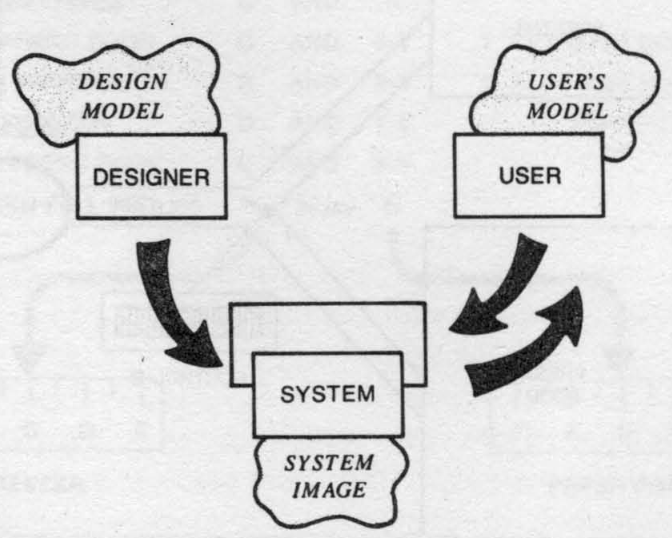
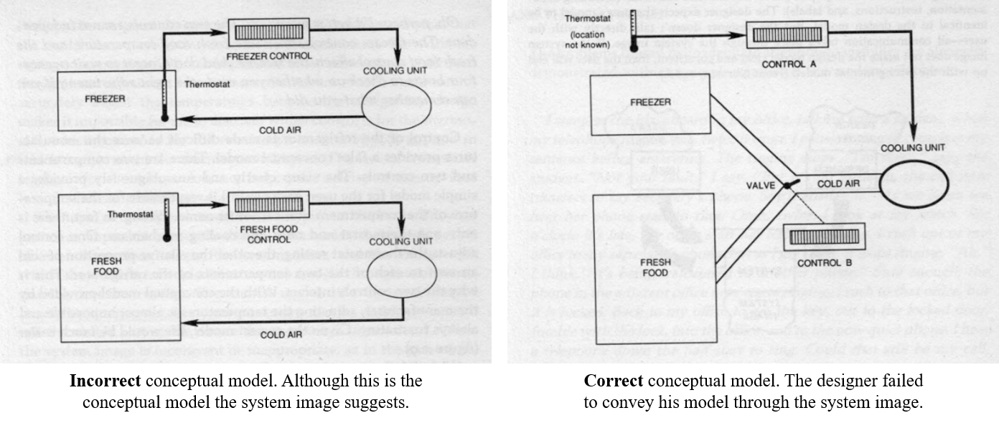

## 28.02.20 Communicating conceptual models

### What is a conceptual model?

A conceptual model is effectively a mental model that someone has about a system. This mental model outlines the core elements of the system, providing a general expectation about how are the main components of the system organized, how they affect each other and how can the system be navigated or traversed.

This mental model is markedly conceptual, hence the term "conceptual model. Generally, conceptual models are broken up into two sides: (1) designer's conceptual model and (2) user's conceptual model.

    
    
Source: Norman, D. (2013). The design of everyday things. Basic books.

The designer has an understanding about the system he or she designs, then this conceptual model is translated into a concrete system. The users of the system may very well not be aware of the guts of the system, but there must exist an interface of "system image" that presents itself to its users. 

**A good system image should faithfully convey the designer's conceptual model to the users of such system**.

### Conceptual models of a refrigerator cooling mechanism

Consider a refrigerator that has two controls to interact with its cooling mechanism; on control is labeled "freezer", the other, "fresh food". The conceptual model of the user that could sensibly emerge from these controls and their labels is the one presented on the left image below. Each control affects a different cooling unit, local to the compartment the label indicates.

    
    
Source: Norman, D. (2013). The design of everyday things. Basic books.

However, in this case, the system image (composed by the controls and its labels) is not faithfully conveying the designer's conceptual model, since the actual conceptual model of the system is the one presented on the right image above. Don Norman explains in his book that this confusion results in one big problem for the user: the controls don't behave as expected, making a real challenge the simple task of setting the temperature.

### Conveying the *correct* conceptual model to users

The *correct* conceptual model is the designer's conceptual model, and carrying that model unstained through the trip of `designer model -> system image -> user model`, can prove to be hard. Many designers are aware about the importance of conveying not just a sense of organization, but the correct model.

#### Direct conveyance

Recently I started to use Wrike, an organization application. Something that caught my eye was the approach of the introductory video, the very first prompt that appears when first trying to use the app. A snapshot of the start of the video is shown in the image below.

    
    
Source: <a href="https://www.youtube.com/watch?v=nPWhgp1Ad9I&t=183s">[Tutorial] Spaces, Projects, Folders, & Tasks in Wrike</a>

The video begins by explaining the core elements of organization of the system, immediately providing information about what are the categories in which data can be organized, what data is expected to be organized in which category and how the categories relate to each other. This is a central part of the conceptual model of Wrike.

Another example of direct explanation of the conceptual model is the store Fantasías Miguel. Differently from many other stores, Fantasías Miguel organizes its products into "projects" and "themes". Contrast this with the traditional organization of Walmart, which can be found in many more stores.

At Fantasías Miguel the conceptual model is conveyed through the signs, but also through audio. There are moments where the music stops to present an ad, but other times a line similar to "En Fantasías Miguel puedes encontrar todo lo que necesitas para un bautizo, fiesta infantil, despedida de soltera y más. Visite la zona indicada para cada evento de su interés" is heard from the speakers.

    

#### Indirect conveyance

Communicating the correct conceptual model to the users mustn't necessarily be in a direct, in-your-face manner (although doing so lightly can often be a good idea). Gestalt theory proposes a set of principles about human perception that can be used to more subtly communicate organization, flow and relation. I briefly touch this theory on my previous entry titled [My understanding of Gestalt theory](entry_3.md).
